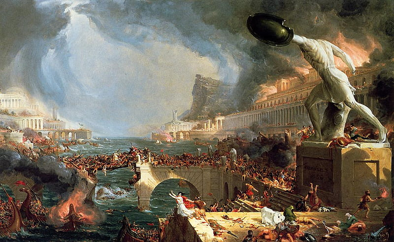

# RomanMathOperations

They say the Roman Empire fell because of political turmoil, but maybe it was just too hard to calculate battle logistics with numbers like `MMCMXCIX`. While we can't rewrite history, this project makes Roman math a little less daunting.

  

This is a C# project implementing arithmetic operations for Roman numerals **without converting them to integers**. It supports addition, subtraction, multiplication, and division, ensuring the rules and conventions of Roman numerals are strictly followed. The project also includes robust input validation and handles invalid or improperly formatted Roman numerals gracefully.

## Features

- **Arithmetic Operations**:
    - **Addition**: Combines two Roman numerals into their sum.
    - **Subtraction**: Computes the difference between two Roman numerals.
    - **Multiplication**: Multiply two Roman numerals. For results exceeding 4,000, a special representation is used where multiple `M` characters are replaced with a numerical value followed by `M` (e.g., `MMMM` becomes `4M`).
    - **Division**: Divides one Roman numeral by another and provides both the quotient and remainder.

- **Validation**:
  - Detects invalid characters in Roman numerals (valid characters are `I`, `V`, `X`, `L`, `C`, `D`, `M`).
  - Ensures input follows valid Roman numeral formatting rules (e.g., prevents invalid sequences like `XXXX`).

- **Custom Exceptions**:
    - `InvalidRomanCharacter`: Raised when an invalid character is found in a Roman numeral.
    - `InvalidRomanFormat`: Raised when Roman numerals are not formatted correctly.
    - `InvalidRomanSubtractionException`: Raised when attempting to subtract a larger number from a smaller one.
    - `ResultIsZeroException`: Raised when an operation results in zero, which did not exist in Roman numeral systems.

## Tests

**The project includes comprehensive unit tests covering**:
- Arithmetic operations (addition, subtraction, multiplication, and division).
- Validation of invalid characters and formats.
- Exception handling for invalid operations.

## License

This project is licensed under the MIT License. See the [LICENSE](LICENSE) file for details.
